# Documentación Técnica del Sistema "Tag-Based File System" (TBFS)

Este sistema permite gestionar archivos mediante etiquetas utilizando una API REST, una interfaz de línea de comandos y una interfaz gráfica web. El proyecto utiliza Python, FastAPI, Streamlit y Docker para su despliegue, facilitando la organización, búsqueda y manejo de archivos a través de etiquetas.

---

## 📦 `database.py`

Este módulo gestiona la inicialización, conexión y limpieza de la base de datos SQLite que contiene la información de archivos y etiquetas.

### Funcionalidades principales

- **Conexión a la base de datos**: crea y devuelve una conexión y cursor a la base de datos SQLite.
- **Inicialización**: crea las tablas `files`, `tags` y `file_tags` si no existen.
- **Cierre de conexión**: cierra de forma segura la conexión.
- **Reseteo**: elimina todas las tablas, archivos en almacenamiento y reinicia la base de datos.

### Esquema de la Base de Datos

```mermaid
erDiagram
    files {
        int id PK
        text name UNIQUE NOT NULL
        text path NOT NULL
    }
    tags {
        int id PK
        text tag UNIQUE
    }
    file_tags {
        int file_id PK, FK
        int tag_id PK, FK
    }
    files ||--o{ file_tags : contiene
    tags ||--o{ file_tags : clasifica
```

**Explicación:**
- Un archivo puede tener múltiples etiquetas.
- Una etiqueta puede pertenecer a múltiples archivos.
- Relación muchos-a-muchos modelada con `file_tags`.

---

## 📁 `manager.py`

Este archivo contiene la lógica de negocio para manipular archivos y etiquetas dentro del sistema.

### Funcionalidades principales

- **add_files**: Añade archivos al sistema, copiándolos al almacenamiento interno y asociando etiquetas.
- **query_files**: Consulta archivos filtrando por etiquetas (AND).
- **list_files**: Imprime y retorna archivos consultados.
- **delete_files**: Elimina archivos (registros y ficheros físicos) filtrados por etiquetas.
- **add_tags**: Añade nuevas etiquetas a archivos existentes.
- **delete_tags**: Elimina relaciones de etiquetas de archivos seleccionados.
- **download_file**: Copia archivos desde el almacenamiento interno a un destino local.
- **get_file_path**: Devuelve la ruta real de un archivo almacenado.

### Flujo de operaciones

```mermaid
flowchart TD
    Start([Usuario])
    Add[Agregar Archivo]
    Q[Consulta por Etiquetas]
    Del[Eliminar Archivos]
    AddT[Agregar Etiquetas]
    DelT[Eliminar Etiquetas]
    Down[Descargar Archivo]
    DB[(Base de datos SQLite)]
    Storage[Storage (Archivos físicos)]

    Start --> Add --> DB
    Add --> Storage
    Start --> Q --> DB
    Q --> Start
    Start --> Del --> DB
    Del --> Storage
    Start --> AddT --> DB
    Start --> DelT --> DB
    Start --> Down --> DB
    Down --> Storage --> Start
```

---

## 🖥️ `main.py`

Script CLI para interactuar con la API desde la terminal. Traduce los comandos de usuario en llamadas HTTP al backend.

### Comandos soportados

- **add**: Sube archivos con etiquetas.
- **list**: Lista archivos, filtrando por etiquetas.
- **delete**: Elimina archivos por etiquetas.
- **add-tags**: Añade etiquetas a archivos existentes.
- **delete-tags**: Elimina etiquetas de archivos.
- **download**: Descarga archivos por nombre.

### Ejemplo de uso

```bash
python main.py add ejemplo.txt etiqueta1,etiqueta2
python main.py list etiqueta1
python main.py delete etiqueta2
python main.py add-tags etiqueta1 nueva_etiqueta
python main.py delete-tags etiqueta1 etiqueta_a_eliminar
python main.py download ejemplo.txt ./descargas/
```

---

## 🐳 `docker-compose.yml`

Orquesta los servicios de backend y frontend en contenedores Docker.

| Servicio  | Imagen         | Puerto      | Directorio de trabajo | Variables Entorno           |
|-----------|---------------|-------------|----------------------|-----------------------------|
| backend   | tbfs-backend  | 8000:8000   | /back                | -                           |
| frontend  | tbfs-frontend | 8501:8501   | /front               | API_URL, DOWNLOAD_DIR       |

- **Red:** Utiliza la red overlay `tbfs_net`.
- **Despliegue:** Permite escalabilidad y reinicio automático ante fallos.

---

## ⚙️ `run_swarm.sh` y `run_local.sh`

### `run_swarm.sh`

Automatiza la construcción de imágenes y el despliegue con Docker Swarm.

```bash
#!/bin/bash
docker build -t tbfs-backend -f server/dockerfile.yml .
docker build -t tbfs-frontend -f gui/dockerfile.yml .
docker swarm init
docker stack deploy -c docker-compose.yml tbfs
```

### `run_local.sh`

Lanza ambos servidores localmente (API y GUI) para pruebas rápidas.

```bash
#!/bin/bash
uvicorn server.api:app --host 0.0.0.0 --port 8000 &
streamlit run gui/web.py
```

---

## 🐳 `dockerfile.yml` (GUI y Backend)

### `gui/dockerfile.yml`

Construye la imagen de la interfaz web con Streamlit.

```Dockerfile
FROM python:3.12-slim
WORKDIR /front
COPY gui/ /front/
COPY main.py /front/
RUN pip install --no-cache-dir requests streamlit
EXPOSE 8501
ENV API_URL=http://backend:8000
ENV DOWNLOAD_DIR="downloads"
CMD ["streamlit", "run", "web.py", "--server.port=8501", "--server.address=0.0.0.0"]
```

### `server/dockerfile.yml`

Construye la imagen del backend API.

```Dockerfile
FROM python:3.12-slim
WORKDIR /back
COPY core /back/core
COPY server /back/server
RUN pip install --no-cache-dir fastapi uvicorn requests python-multipart
EXPOSE 8000
CMD ["uvicorn", "server.api:app", "--host", "0.0.0.0", "--port", "8000"]
```

---

## 🌐 `web.py`

Interfaz gráfica del sistema usando Streamlit.

### Características

- **Visualización paginada** de archivos y etiquetas.
- **Múltiples acciones**: subir, eliminar, agregar/eliminar etiquetas, descargar archivos.
- **Filtros** por etiquetas.
- **Botones contextuales** para cada acción.
- **Feedback inmediato** al usuario (éxitos/errores).

### Interacción de componentes

```mermaid
sequenceDiagram
    participant User as Usuario
    participant Web as Streamlit (web.py)
    participant API as FastAPI (api.py)
    participant DB as Database/Storage

    User->>Web: Clic en botón (Agregar, Eliminar, Descargar)
    Web->>API: Llama endpoint HTTP correspondiente
    API->>DB: Consulta o modifica archivos/etiquetas
    API-->>Web: Respuesta (éxito/fallo)
    Web-->>User: Mensaje visual (success/error)
```



---

## 🚀 `api.py` (Server API)

La API RESTful (FastAPI) centraliza el acceso a los archivos y etiquetas.

### Endpoints Disponibles

Cada endpoint relevante incluye su bloque interactivo de documentación.

---

```api
{
    "title": "Estado del servidor",
    "description": "Verifica que el backend esté funcionando",
    "method": "GET",
    "baseUrl": "http://127.0.0.1:8000",
    "endpoint": "/",
    "headers": [],
    "queryParams": [],
    "pathParams": [],
    "bodyType": "none",
    "requestBody": "",
    "responses": {
        "200": {
            "description": "Servidor funcionando",
            "body": "{\n  \"message\": \"Servidor funcionando\"\n}"
        }
    }
}
```

---

```api
{
    "title": "Subir archivo",
    "description": "Sube un archivo al sistema con etiquetas asociadas",
    "method": "POST",
    "baseUrl": "http://127.0.0.1:8000",
    "endpoint": "/add",
    "headers": [
        { "key": "Content-Type", "value": "multipart/form-data", "required": true }
    ],
    "queryParams": [],
    "pathParams": [],
    "bodyType": "form",
    "formData": [
        { "key": "file", "value": "Archivo a subir", "required": true },
        { "key": "tags", "value": "etiquetas separadas por coma", "required": true }
    ],
    "responses": {
        "200": {
            "description": "Archivo agregado correctamente",
            "body": "{\n  \"success\": true,\n  \"message\": \"Archivo 'nombre.ext' agregado correctamente\"\n}"
        },
        "400": {
            "description": "Error al agregar archivo",
            "body": "{\n  \"detail\": \"No se pudo agregar el archivo\"\n}"
        }
    }
}
```

---

```api
{
    "title": "Listar archivos",
    "description": "Listar todos los archivos y sus etiquetas; permite filtrar por etiquetas (AND)",
    "method": "GET",
    "baseUrl": "http://127.0.0.1:8000",
    "endpoint": "/list",
    "headers": [],
    "queryParams": [
        { "key": "tags", "value": "etiquetas a buscar (puede repetirse)", "required": false }
    ],
    "pathParams": [],
    "bodyType": "none",
    "requestBody": "",
    "responses": {
        "200": {
            "description": "Listado de archivos",
            "body": "{\n  \"files\": [\n    { \"id\": 1, \"name\": \"ejemplo.txt\", \"tags\": \"etiqueta1,etiqueta2\", \"path\": \"/storage/1_ejemplo.txt\" } \n  ]\n}"
        }
    }
}
```

---

```api
{
    "title": "Eliminar archivos",
    "description": "Elimina archivos que cumplan con las etiquetas indicadas",
    "method": "DELETE",
    "baseUrl": "http://127.0.0.1:8000",
    "endpoint": "/delete",
    "headers": [],
    "queryParams": [
        { "key": "tags", "value": "etiquetas separadas por coma", "required": true }
    ],
    "pathParams": [],
    "bodyType": "none",
    "requestBody": "",
    "responses": {
        "200": {
            "description": "Resultado de la eliminación",
            "body": "{\n  \"success\": true,\n  \"message\": \"Archivos eliminados\"\n}"
        }
    }
}
```

---

```api
{
    "title": "Agregar etiquetas a archivos",
    "description": "Agrega nuevas etiquetas a todos los archivos que coincidan con la consulta",
    "method": "POST",
    "baseUrl": "http://127.0.0.1:8000",
    "endpoint": "/add-tags",
    "headers": [],
    "queryParams": [
        { "key": "query", "value": "etiquetas de búsqueda", "required": true },
        { "key": "new_tags", "value": "nuevas etiquetas a agregar", "required": true }
    ],
    "pathParams": [],
    "bodyType": "none",
    "requestBody": "",
    "responses": {
        "200": {
            "description": "Resultado",
            "body": "{\n  \"success\": true\n}"
        }
    }
}
```

---

```api
{
    "title": "Eliminar etiquetas de archivos",
    "description": "Elimina etiquetas de todos los archivos que coincidan con la consulta",
    "method": "POST",
    "baseUrl": "http://127.0.0.1:8000",
    "endpoint": "/delete-tags",
    "headers": [],
    "queryParams": [
        { "key": "query", "value": "etiquetas de búsqueda", "required": true },
        { "key": "del_tags", "value": "etiquetas a eliminar", "required": true }
    ],
    "pathParams": [],
    "bodyType": "none",
    "requestBody": "",
    "responses": {
        "200": {
            "description": "Resultado",
            "body": "{\n  \"success\": true\n}"
        }
    }
}
```

---

```api
{
    "title": "Descargar archivo",
    "description": "Descarga el archivo indicado por nombre",
    "method": "GET",
    "baseUrl": "http://127.0.0.1:8000",
    "endpoint": "/download/{file_name}",
    "headers": [],
    "queryParams": [],
    "pathParams": [
        { "key": "file_name", "value": "Nombre del archivo", "required": true }
    ],
    "bodyType": "none",
    "requestBody": "",
    "responses": {
        "200": {
            "description": "Archivo descargado (stream)",
            "body": "<Archivo binario>"
        },
        "404": {
            "description": "Archivo no encontrado",
            "body": "{\n  \"detail\": \"Archivo no encontrado\" \n}"
        }
    }
}
```

---

## 📝 Resumen

- **Base de datos**: gestiona archivos y etiquetas relacionales.
- **Manager**: lógica de negocio para CRUD y manejo de archivos físicos.
- **API**: expone endpoints REST para integración externa.
- **CLI**: permite interacción directa desde terminal.
- **Web**: interfaz amigable y gráfica, multi-operación.
- **Docker**: facilita despliegue, escalabilidad y portabilidad.

---

¡Este sistema permite una gestión robusta, flexible y visual de archivos usando etiquetas! 🚀